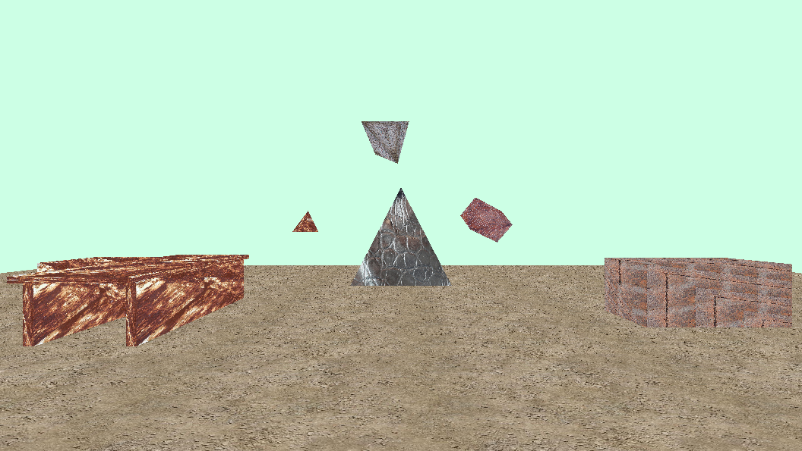
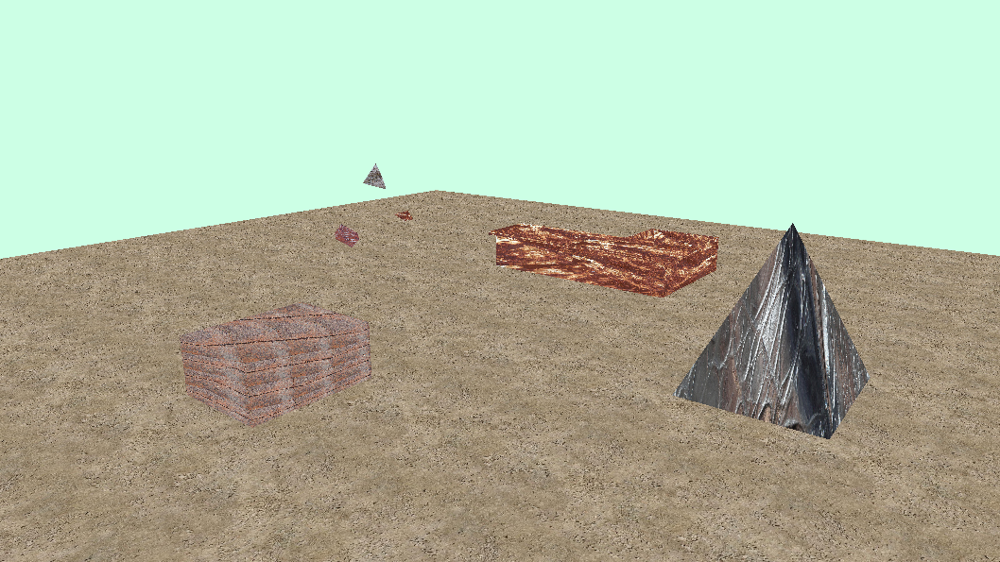
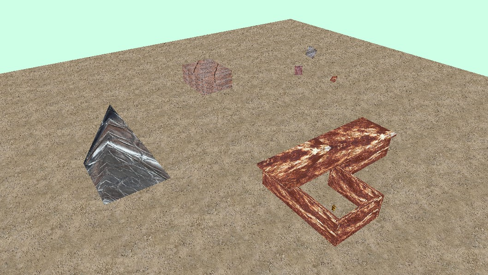

# Rendering-Pipeline-Project

Moderate software project developed as part of my Master's degree studies at HTW Berlin - University of Applied Sciences. The goal was to explore Modern OpenGL, expand my knowledge of computer graphics, and build a simple rendering pipeline. The project features a movable virtual camera, various primitive virtual objects, texture mapping, shader programming, and much more.

    
    
    

